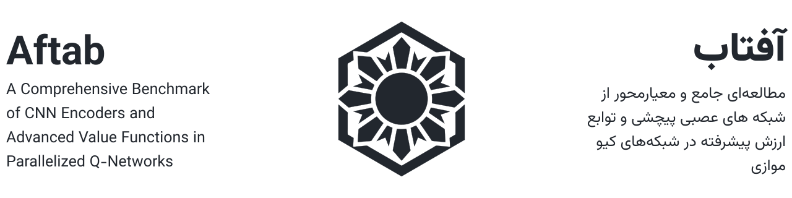

<picture>
  <source media="(prefers-color-scheme: dark)" srcset="../figures/header-dark.svg">
  <source media="(prefers-color-scheme: light)" srcset="../figures/header-light.svg">
  
</picture>

<p align="center">
  
  
  
  
</p>

<p align="center">
  
  
  
</p>

<div align="center">
  <a href="https://underdash.pro">Taha Shieenavaz</a> | <a href="https://shbnmzr.github.io">Shabnam Zareshahraki</a> | <a href="https://scholar.google.com/citations?user=5NSGzcQAAAAJ&hl=en">Loris Nanni</a>
</div>

<br />

<div align="center">
  🇪🇸🇲🇽🇨🇺 <a href="./spanish.md">Español</a> |
  🇮🇷🇦🇫🇹🇯 <a href="./farsi.md">فارسی</a> |
  🇮🇹🇨🇭 <a href="./italian.md">Italiano</a> |
  🇫🇷🇧🇪🇨🇭 <a href="./french.md">Français</a> |
  🇩🇪🇦🇹🇨🇭 <a href="./german.md">Deutsch</a> |
  🇳🇱🇧🇪🇸🇷 <a href="./dutch.md">Nederlands</a> |
  🇵🇹🇧🇷🇦🇴 <a href="./portuguese.md">Português</a> |
  🇸🇦🇱🇧🇮🇶 <a href="./arabic.md">العربية</a> |
  🇷🇺🇧🇾🇰🇿 <a href="./russian.md">Русский</a> |
  🇨🇳🇸🇬🇹🇼 <a href="./chinese.md">中文</a> |
  🇯🇵 <a href="./japanese.md">日本語</a> |
  🇰🇷 <a href="./korean.md">한국어</a> |
  🇮🇳 <a href="./hindi.md">हिन्दी</a> |
  🇮🇩 <a href="./indonesian.md">Bahasa Indonesia</a> |
  🇧🇩🇮🇳 <a href="./bengali.md">বাংলা</a> |
  🇻🇳 <a href="./vietnamese.md">Tiếng Việt</a> |
  🇹🇷 <a href="./turkish.md">Türkçe</a>
</div>

## Descripción general

**Aftab** (del <a href="https://en.wikipedia.org/wiki/Aftab">persa</a> آفتاب, que significa «sol» o «rayos de sol») es un framework de benchmarking para evaluar codificadores basados en CNN empleados por PQN en distintos <a href="https://en.wikipedia.org/wiki/Atari_Games">juegos de Atari</a>. Ofrece herramientas estandarizadas de entrenamiento, evaluación y reproducibilidad para la investigación en aprendizaje por refuerzo profundo.

Hemos recopilado varios vídeos que comparan los agentes de PQN y Aftab. Puedes verlos [aquí](../videos.md).

### Experimentos con codificadores

<div align="center">
  <table>
    <tr>
      <th>IQM HNS</th>
    </tr>
    <tr>
      <td>
        <picture>
          <source media="(prefers-color-scheme: dark)" srcset="https://raw.githubusercontent.com/tahashieenavaz/aftab/main/figures/encoder_experiments/global_dark.png" />
          
        </picture>
      </td>
    </tr>
    <tr>
      <th>IQM HNS (últimos 50 millones de fotogramas)</th>
    </tr>
    <tr>
      <td>
        <picture>
          <source media="(prefers-color-scheme: dark)" srcset="https://raw.githubusercontent.com/tahashieenavaz/aftab/main/figures/encoder_experiments/global_zoomed_dark.png" />
          
        </picture>
      </td>
    </tr>
  </table>
</div>

### Experimentos con Hadamax

<div align="center">
  <table>
    <tr>
      <th>IQM HNS</th>
    </tr>
    <tr>
      <td>
        <picture>
          <source media="(prefers-color-scheme: dark)" srcset="https://raw.githubusercontent.com/tahashieenavaz/aftab/main/figures/hadamax_experiments/global_dark.png" />
          
        </picture>
      </td>
    </tr>
    <tr>
      <th>IQM HNS (últimos 50 millones de fotogramas)</th>
    </tr>
    <tr>
      <td>
        <picture>
          <source media="(prefers-color-scheme: dark)" srcset="https://raw.githubusercontent.com/tahashieenavaz/aftab/main/figures/hadamax_experiments/global_zoomed_dark.png" />
          
        </picture>
      </td>
    </tr>
  </table>
</div>

Referencias:
- [Hadamax Encoding: Elevating Performance in Model-Free Atari](https://arxiv.org/abs/2505.15345)

### Experimentos con valores Q

<div align="center">
  <table>
    <tr>
      <th>IQM HNS</th>
    </tr>
    <tr>
      <td>
        <picture>
          <source media="(prefers-color-scheme: dark)" srcset="https://raw.githubusercontent.com/tahashieenavaz/aftab/main/figures/qvalue_experiments/global_dark.png" />
          
        </picture>
      </td>
    </tr>
    <tr>
      <th>IQM HNS (últimos 50 millones de fotogramas)</th>
    </tr>
    <tr>
      <td>
        <picture>
          <source media="(prefers-color-scheme: dark)" srcset="https://raw.githubusercontent.com/tahashieenavaz/aftab/main/figures/qvalue_experiments/global_zoomed_dark.png" />
          
        </picture>
      </td>
    </tr>
  </table>
</div>

Referencias:
- [Stop Regressing](https://arxiv.org/abs/2403.03950)
- [Deep Exploration via Bootstrapped DQN](https://arxiv.org/abs/1602.04621)
- [Improving Regression Performance with Distributional Losses](https://arxiv.org/abs/1806.04613)

### Experimentos con Procgen (prevención del sobreajuste)

<div align="center">
  <table>
    <tr>
      <th>IQM PNS</th>
    </tr>
    <tr>
      <td>
        <picture>
          <source media="(prefers-color-scheme: dark)" srcset="https://raw.githubusercontent.com/tahashieenavaz/aftab/main/figures/procgen_experiments/global_dark.png" />
          
        </picture>
      </td>
    </tr>
    <tr>
      <th>IQM PNS (últimos 50 millones de fotogramas)</th>
    </tr>
    <tr>
      <td>
        <picture>
          <source media="(prefers-color-scheme: dark)" srcset="https://raw.githubusercontent.com/tahashieenavaz/aftab/main/figures/procgen_experiments/global_zoomed_dark.png" />
          
        </picture>
      </td>
    </tr>
  </table>
</div>

## Instalación

Instalación mediante pip:

```bash
pip install aftab
```

También puedes clonar el repositorio e instalarlo en modo `editable`.

```bash
git clone https://github.com/tahashieenavaz/aftab.git aftab_source
pip install -e aftab_source
```

Recomendamos encarecidamente usar [Micromamba](https://github.com/mamba-org/micromamba-releases) para crear entornos virtuales. Las instrucciones detalladas están disponibles [aquí](../scripts/README.md).

## Entrenamiento de agentes

**La API de JAX se encuentra actualmente en desarrollo** y está previsto que se complete antes de finales de 2026. Las contribuciones son muy bienvenidas.

```python
from aftab import Aftab
from aftab import aftab_environments

seeds = [1, 2, 3, 4]

for environment in aftab_environments:
    agent = Aftab(encoder="gamma", frames="pilot")
    for seed in seeds:
        agent.train(environment=environment, seed=seed)
        agent.log()
```


## Incorporación de un codificador personalizado

Puedes definir tu propio codificador como un módulo de PyTorch y pasárselo al agente:

```python
import torch
from aftab import Aftab

class CustomImageEncoder(torch.nn.Module):
    pass

agent = Aftab(encoder=CustomImageEncoder)
```


## Resultados

Todos los resultados están organizados por categoría de experimento. Cada sección contiene:
- **Tablas**: resultados numéricos (HNS/PHS y puntuaciones sin normalizar)
- **Gráficos**: puntuaciones normalizadas mediante IQM y curvas de entrenamiento

### Experimentos con codificadores

**Tablas**
- [Puntuaciones normalizadas con respecto al rendimiento humano](../results/encoder_experiments/human_normalized_scores.md)
- [Puntuaciones](../results/encoder_experiments/scores.md)

**Gráficos**
- [IQM HNS](../figures/encoder_experiments/human_normalized_score)
- [Evolución de la pérdida](../figures/encoder_experiments/loss)

---

### Experimentos con Hadamax

**Tablas**
- [Puntuaciones normalizadas con respecto al rendimiento humano](../results/hadamax_experiments/human_normalized_scores.md)
- [Puntuaciones](../results/hadamax_experiments/scores.md)

**Gráficos**
- [IQM HNS](../figures/hadamax_experiments/human_normalized_score)
- [Evolución de la pérdida](../figures/hadamax_experiments/loss)

---

### Experimentos con valores Q

**Tablas**
- [Puntuaciones normalizadas con respecto al rendimiento humano](../results/qvalue_experiments/human_normalized_scores.md)
- [Puntuaciones](../results/qvalue_experiments/scores.md)

**Gráficos**
- [IQM HNS](../figures/qvalue_experiments/human_normalized_score)
- [Evolución de la pérdida](../figures/qvalue_experiments/loss)

---

### Experimentos con Procgen

**Tablas**
- [Puntuaciones normalizadas de Procgen](../results/procgen_experiments/procgen_normalized_scores.md)
- [Puntuaciones](../results/procgen_experiments/scores.md)


## Complejidad de los modelos

### Variantes base

| Variante | Parámetros del codificador | Parámetros de la cabeza de regresión | Parámetros totales | FLOPs del codificador | FLOPs de la cabeza de regresión | FLOPs totales |
| :--- | :--- | :--- | :--- | :--- | :--- | :--- |
| **PQN** | 78,304 | 1,686,500 | 1,764,804 | 7.734 | 1.610 | 9.347 |
| **Alpha** | 174,752 | 1,782,948 | 1,957,700 | 27.541 | 1.610 | 29.151 |
| **Beta** | 89,008 | 1,782,948 | 1,871,956 | 61.515 | 1.610 | 63.126 |
| **Gamma** | 117,168 | 1,725,364 | 1,842,532 | 22.901 | 1.610 | 24.512 |
| **Delta** | 78,552 | 1,850,588 | 1,929,140 | 6.143 | 1.774 | 7.917 |
| **Epsilon** | 80,112 | 2,179,828 | 2,259,940 | 13.252 | 2.101 | 15.354 |
| **Zeta** | 77,232 | 2,537,396 | 2,614,628 | 25.362 | 2.462 | 27.824 |
| **Eta** | 78,400 | 23,739,460 | 23,817,860 | 28.422 | 23.663 | 52.085 |
| **Theta** | 76,288 | 1,127,428 | 1,203,716 | 9.065 | 1.053 | 10.118 |

> **Nota:** la variante Eta tiene muchos más parámetros que las demás, principalmente porque su codificador genera un gran número de características.

---

### Variantes de Hadamax

| Variante | Parámetros del codificador | Parámetros de la cabeza de regresión | Parámetros totales | FLOPs del codificador | FLOPs de la cabeza de regresión | FLOPs totales |
| :--- | :--- | :--- | :--- | :--- | :--- | :--- |
| **Hadamax** | 156,608 | 3,968,516 | 4,125,124 | 159.014 | 3.969 | 162.984 |
| **Gamma-Hadamax-Valid** | 234,336 | 1,609,220 | 1,843,556 | 122.001 | 1.610 | 123.611 |
| **Gamma-Hadamax-Same** | 234,336 | 3,280,388 | 3,514,724 | 129.300 | 3.281 | 132.581 |

## Hiperparámetros

<div align="center">

| Hiperparámetro | Valor |
| :--- | :--- |
| Tasa de aprendizaje | $2.5 \times 10^{-4}$ |
| Entornos de entrenamiento | 128 |
| Entornos de prueba | 8 |
| Optimizador | [Rectified Adam](https://arxiv.org/abs/1908.03265) |
| Decaimiento de pesos | 0 |
| $\epsilon$ | $1 \times 10^{-5}$ |
| $\beta_{1}$ | 0.9 |
| $\beta_{2}$ | 0.999 |
| Fotogramas totales | 200,000,000 |
| Función de pérdida | Error cuadrático medio |
| Planificador | Recocido lineal |
| Exploración $\epsilon$-greedy | 10% of total frames |
| Factor de descuento ($\gamma$) | 0.99 |
| GAE ($\lambda$) | 0.65 |
| Épocas | 2 |
| Tamaño del lote | 4096 |

</div>

<p align="center"><em>Utilizados en los experimentos con codificadores y Hadamax.</em></p>

## Significación estadística

### Experimentos con codificadores

<table>
  <tr>
    <th align="center">Prueba de rangos con signo de Wilcoxon</th>
    <th align="center">Prueba de rangos con signo de Wilcoxon (corregida)</th>
  </tr>
  <tr>
    <td align="center">
      <picture>
        <source media="(prefers-color-scheme: dark)" srcset="https://raw.githubusercontent.com/tahashieenavaz/aftab/main/figures/encoder_experiments/wilcoxon_p_matrix_dark.png" />
        
      </picture>
    </td>
    <td align="center">
      <picture>
        <source media="(prefers-color-scheme: dark)" srcset="https://raw.githubusercontent.com/tahashieenavaz/aftab/main/figures/encoder_experiments/wilcoxon_bonferroni_matrix_dark.png" />
        
      </picture>
    </td>
  </tr>
  <tr>
    <th colspan="2" align="center">Probabilidad de mejora</th>
  </tr>
  <tr>
    <td colspan="2" align="center">
      <picture>
        <source media="(prefers-color-scheme: dark)" srcset="https://raw.githubusercontent.com/tahashieenavaz/aftab/main/figures/encoder_experiments/probability_of_improvement_dark.png" />
        
      </picture>
    </td>
  </tr>
</table>

### Experimentos con Hadamax

<table>
  <tr>
    <th align="center">Prueba de rangos con signo de Wilcoxon</th>
    <th align="center">Prueba de rangos con signo de Wilcoxon (corregida)</th>
  </tr>
  <tr>
    <td align="center">
      <picture>
        <source media="(prefers-color-scheme: dark)" srcset="https://raw.githubusercontent.com/tahashieenavaz/aftab/main/figures/hadamax_experiments/wilcoxon_p_matrix_dark.png" />
        
      </picture>
    </td>
    <td align="center">
      <picture>
        <source media="(prefers-color-scheme: dark)" srcset="https://raw.githubusercontent.com/tahashieenavaz/aftab/main/figures/hadamax_experiments/wilcoxon_bonferroni_matrix_dark.png" />
        
      </picture>
    </td>
  </tr>
  <tr>
    <th colspan="2" align="center">Probabilidad de mejora</th>
  </tr>
  <tr>
    <td colspan="2" align="center">
      <picture>
        <source media="(prefers-color-scheme: dark)" srcset="https://raw.githubusercontent.com/tahashieenavaz/aftab/main/figures/hadamax_experiments/probability_of_improvement_dark.png" />
        
      </picture>
    </td>
  </tr>
</table>

### Experimentos con valores Q

<table>
  <tr>
    <th align="center">Prueba de rangos con signo de Wilcoxon</th>
    <th align="center">Prueba de rangos con signo de Wilcoxon (corregida)</th>
  </tr>
  <tr>
    <td align="center">
      <picture>
        <source media="(prefers-color-scheme: dark)" srcset="https://raw.githubusercontent.com/tahashieenavaz/aftab/main/figures/qvalue_experiments/wilcoxon_p_matrix_dark.png" />
        
      </picture>
    </td>
    <td align="center">
      <picture>
        <source media="(prefers-color-scheme: dark)" srcset="https://raw.githubusercontent.com/tahashieenavaz/aftab/main/figures/qvalue_experiments/wilcoxon_bonferroni_matrix_dark.png" />
        
      </picture>
    </td>
  </tr>
  <tr>
    <th colspan="2" align="center">Probabilidad de mejora</th>
  </tr>
  <tr>
    <td colspan="2" align="center">
      <picture>
        <source media="(prefers-color-scheme: dark)" srcset="https://raw.githubusercontent.com/tahashieenavaz/aftab/main/figures/qvalue_experiments/probability_of_improvement_dark.png" />
        
      </picture>
    </td>
  </tr>
</table>

## Reproducibilidad

Debido a la naturaleza estocástica del aprendizaje por refuerzo profundo, no es posible reproducir exactamente los resultados mediante conjuntos de datos fijos.
Por ello, proporcionamos el conjunto de semillas aleatorias utilizado en nuestros experimentos.

```python
from aftab import aftab_seeds

print(aftab_seeds)
```

Reproducción completa de los experimentos:

```python
from aftab import Aftab
from aftab import aftab_environments
from aftab import aftab_seeds

for environment in aftab_environments:
    agent = Aftab()
    for seed in aftab_seeds:
        agent.train(environment=environment, seed=seed)
        agent.log()
```

EnvPool ofrece una amplia colección de entornos de Atari:
https://envpool.readthedocs.io/en/latest/env/atari.html#available-tasks

Los entornos de Procgen utilizan sus observaciones RGB nativas con forma `(3, 64, 64)`.
Aftab lee la configuración de EnvPool de cada tarea y solo aplica las opciones compatibles.
Por tanto, las opciones exclusivas de Atari, como `noop`, `frame_skip`, `frame_stack` y
`train_episodic_life`, así como el recorte de recompensas de EnvPool, no se pasan a
Procgen.

EnvPool ofrece una amplia colección de entornos de Procgen:

https://envpool.readthedocs.io/en/latest/env/procgen.html#available-tasks

## Hardware

Todos los experimentos de este proyecto se ejecutaron en GPU [Nvidia A40](https://www.nvidia.com/en-us/data-center/a40).

| Especificación | Detalles |
|--------------|----------|
| Memoria de la GPU | 48 GB GDDR6 con código de corrección de errores (ECC) |
| Ancho de banda de la memoria de la GPU | 696 GB/s |
| Interconexión | NVIDIA NVLink 112,5 GB/s (bidireccional); PCIe Gen4: 64 GB/s |
| NVLink | Bidireccional, perfil bajo (2 ranuras) |
| Puertos de pantalla | 3x DisplayPort 1.4* |
| Consumo máximo | 300 W |
| Formato | 4,4" (Al.) × 10,5" (L.), doble ranura |
| Refrigeración | Pasiva |
| Software vGPU compatible | NVIDIA Virtual PC, NVIDIA Virtual Applications, NVIDIA RTX Virtual Workstation, NVIDIA Virtual Compute Server, NVIDIA AI Enterprise |
| Perfiles vGPU compatibles | Consulta la guía de licencias de Virtual GPU |
| NVENC / NVDEC | 1x / 2x (incluye decodificación AV1) |
| Arranque seguro | Arranque seguro y medido con raíz de confianza de hardware (opcional) |
| Compatibilidad con NEBS | Nivel 3 |
| Conector de alimentación | CPU de 8 pines |

## Cita

```bibtex
@article{aftab2026drl,
  title={Aftab: A Comprehensive Benchmark of CNN Encoders and Advanced Value Functions in Parallelized Q-Networks},
  author={Shieenavaz, Taha and Zareshahraki, Shabnam and Nanni, Loris},
  journal={arXiv preprint arXiv:YYMM.NNNNN},
  year={2026}
}
```

### Trabajos relacionados

```bibtex
@misc{2407.04811,
  Title = {Simplifying Deep Temporal Difference Learning},
  Author = {Matteo Gallici and Mattie Fellows and Benjamin Ellis and Bartomeu Pou and Ivan Masmitja and Jakob Nicolaus Foerster and Mario Martin},
  Year = {2024},
  Eprint = {arXiv:2407.04811},
}
```

```bibtex
@misc{2403.03950,
  Title = {Stop Regressing: Training Value Functions via Classification for Scalable Deep RL},
  Author = {Jesse Farebrother and Jordi Orbay and Quan Vuong and Adrien Ali Taïga and Yevgen Chebotar and Ted Xiao and Alex Irpan and Sergey Levine and Pablo Samuel Castro and Aleksandra Faust and Aviral Kumar and Rishabh Agarwal},
  Year = {2024},
  Eprint = {arXiv:2403.03950},
}
```

```bibtex
@misc{1511.06581,
  Title = {Dueling Network Architectures for Deep Reinforcement Learning},
  Author = {Ziyu Wang and Tom Schaul and Matteo Hessel and Hado van Hasselt and Marc Lanctot and Nando de Freitas},
  Year = {2015},
  Eprint = {arXiv:1511.06581},
}
```

```bibtex
@misc{1806.04613,
  Title = {Improving Regression Performance with Distributional Losses},
  Author = {Ehsan Imani and Martha White},
  Year = {2018},
  Eprint = {arXiv:1806.04613},
}
```

```bibtex
@misc{1602.04621,
  Title = {Deep Exploration via Bootstrapped DQN},
  Author = {Ian Osband and Charles Blundell and Alexander Pritzel and Benjamin Van Roy},
  Year = {2016},
  Eprint = {arXiv:1602.04621},
}
```

## Enlaces útiles

- [Wikipedia: aprendizaje por refuerzo (RL)](https://en.wikipedia.org/wiki/Reinforcement_learning)
- [Wikipedia: aprendizaje por refuerzo profundo (DRL)](https://en.wikipedia.org/wiki/Deep_reinforcement_learning)
- [Wikipedia: aprendizaje Q](https://en.wikipedia.org/wiki/Q-learning)
- [Wikipedia: PyTorch](https://en.wikipedia.org/wiki/PyTorch)
- [Wikipedia: prueba de hipótesis estadística](https://en.wikipedia.org/wiki/Statistical_hypothesis_test)
- [Wikipedia: prueba de rangos con signo de Wilcoxon](https://en.wikipedia.org/wiki/Wilcoxon_signed-rank_test)
- [PyTorch](https://pytorch.org/)

## Licencia

© 2025 Taha Shieenavaz.
Publicado bajo la licencia CC BY-NC 4.0: https://creativecommons.org/licenses/by-nc/4.0/
